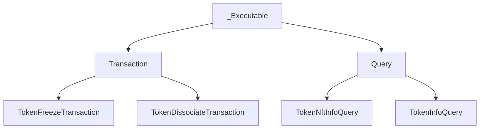

# _Executable Class Training

## Table of Contents

- [Introduction to _Executable](#introduction-to-_executable)
- [Execution Flow](#execution-flow)
- [Retry Logic](#retry-logic)
- [Exponential backoff](#exponential-backoff)
- [Error Handling](#error-handling)
- [Logging & Debugging](#logging-&-debugging)
- [Practical Examples](#practical-examples)

## Introduction to _Executable
 * The _Executable class is the backbone of the Hedera SDK execution engine. It handles sending transactions and queries, retry logic, error mapping, and logging, allowing child classes (like Transaction and Query) to focus on business logic.




## Execution Flow

-How _execute(client) works in the Hedera SDK?

 The typical execution flow for transactions and queries using the Executable interface follows these steps:

 1. **Build** → Create the transaction/query with required parameters
 2. **FreezeWith(client)** → Locks the transaction for signing
 3. **Sign(privateKey)** → Add required signatures
 4. **Execute(client)** → Submit to the network
 5. **GetReceipt(client)** → Confirm success/failure


Here’s how child classes hook into the execution pipeline:

| Command | Description |
| --- | --- |
| `_make_request` | Build the protobuf request for this operation. Example: a transaction class serializes its body into a Transaction proto; a query class builds the appropriate query proto. |
| `_get_method(channel: _Channel) -> _Method` | Choose which gRPC stub method to call. You get service stubs from channel, then return _Method(transaction_func=...) for transactions or _Method(query_func=...) for queries. The executor calls _execute_method, which picks transaction if present, otherwise query. |
| `_map_status_error(response)` | Inspect the network response status and convert it to an appropriate exception (precheck/receipt). This lets the executor decide whether to raise or retry based on _should_retry. |
| `_should_retry(response) -> _ExecutionState` | _ExecutionState: Decide the execution state from the response/status: RETRY, FINISHED, ERROR, or EXPIRED. This drives the retry loop and backoff. |
| `_map_response(response, node_id, proto_request)` | Convert the raw gRPC/Proto response into the SDK’s response type (e.g., TransactionResponse, Query result) that gets returned to the caller. |


## Retry Logic
 - Core Logic:
  1. Loop up to max_attempts times — The outer for loop tries the operation multiple times
  2. Exponential backoff — Each retry waits longer than the previous one
  3. Execute and check response — After execution, determine if we should retry, fail, or succeed
  4. Smart error handling — Different errors trigger different actions


**_Retry logic = Try the operation, wait progressively longer between attempts, pick a different node if needed, and give up after max attempts. This makes the system resilient to temporary network hiccups._**

-Handling network failures, gRPC errors, and node rotation

## Exponential backoff
Key Steps:

 * First retry: wait `_min_backoff` ms
 * Second retry: wait 2× that
 * Third retry: wait 4× that (doubling each time)
 * Stops growing at `_max_backoff`

  _(Why? Gives the network time to recover between attempts without hammering it immediately.)_


Error Handling
```python
except grpc.RpcError as e:
    err_persistant = f"Status: {e.code()}, Details: {e.details()}"
    node = client.network._select_node()  # Switch nodes
    logger.trace("Switched to a different node...", "error", err_persistant)
    continue  # Retry with new node
```
Retryable gRPC codes:

  * `UNAVAILABLE — Node` down/unreachable
  * `DEADLINE_EXCEEDED` — Request timeout
  * `RESOURCE_EXHAUSTED` — Rate limited
  * `INTERNAL` — Server error
  _(If the [gRPC](https://en.wikipedia.org/wiki/GRPC) call itself fails, switch to a different network node and retry.)_

## Error Handling

 * Mapping network errors to Python exceptions
 Abstract method that child classes implement:
 ```python
 @abstractmethod
 def _map_status_error(self, response):
     """Maps a response status code to an appropriate error object."""
     raise NotImplementedError(...)
 ```

 * Precheck errors --> PrecheckError (e.g., invalid account, insufficient balance)
 * Receipt errors --> ReceiptStatusError (e.g., transaction executed but failed)
 * Other statuses --> Appropriate exception types based on the status code


 *Retryable vs Fatal Errors
  Determined by _should_retry(response) → _ExecutionState:

 ```python
 @abstractmethod
 def _should_retry(self, response) -> _ExecutionState:
     """Determine whether the operation should be retried based on the response."""
     raise NotImplementedError(...)
 ```

  The response is checked via `_should_retry()` which returns one of four `Execution States`:

| State          | Action                                  |                                        
| :--------------| :---------------------------------------| 
| **RETRY**      | `Wait (backoff), then loop again`       | 
| **FINISHED**   | `Success! Return the response`          | 
| **ERROR**      | `Permanent failure, raise exception`    |
| **EXPIRED**    | `Request expired, raise exception`      | 


## Logging & Debugging

-Request ID tracking

-Attempt numbers, node info, backoff logging

-Tips for debugging transaction/query failures

## Practical Examples

